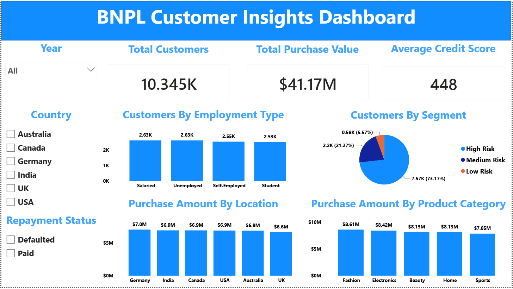

# Data Analytics Portfolio
# Project 1
**Title:** [England Regional Property Market Dashboard](England_Regional_Property_Market_Dashboard.xlsx)

**Tools Used:** Microsoft Excel (Pivot Table, Pivot Chart, Slicers)

**Project Description:** This project involved analysing England’s regional property market data to identify trends and patterns in house prices, and market performance across different regions. It is designed to provide a comprehensive overview of key property market metrics and enable stakeholders to easily monitor and compare market performance across regions and over time. The dashboard includes the following features:

Average House Price by Region: Visual representation of average property prices across different regions of England, highlighting variations in housing costs.

Property Price Trends Over Time: A time-based analysis of house prices, providing insights into how the property market has changed across different periods.

Additionally, the dashboard includes interactive filters and controls for:

Region: Focus on a specific region of England to analyse its property market performance.

Time Period: Filter the data by specific years or periods to examine changes and trends over time.

**Key findings:**
Regional Price Differences: Identified significant differences in property prices across England, with some regions consistently recording higher average house prices than others.

Regional Market Performance: Highlighted variations in property market activity across regions, helping to identify areas with stronger or weaker transaction levels.

Market Volatility: Analysed fluctuations in regional property prices and transaction activity, highlighting periods of stronger growth or slower market performance.

Regional Opportunities: The comparison of house prices and market activity helps identify regions that may offer potential opportunities for buyers, investors, and other property market stakeholders.

This dashboard serves as a valuable analytical tool for property investors, buyers, estate agents, and other stakeholders, providing clear and accessible insights into England’s regional property market. It supports informed decision-making by allowing users to compare regions, monitor market trends, and identify changes in property market performance over time.

**Dashboard Overview:**

# Project 2
**Title:** [BNPL Customer Insights Dashboard](Buy_Now_Pay_Later_Dashboard.pbix)

**Tools Used:** Power BI (Power query, DAX, Dashboard)

**Project Description:**

**Key findings:**

**Dashboard Overview:**

